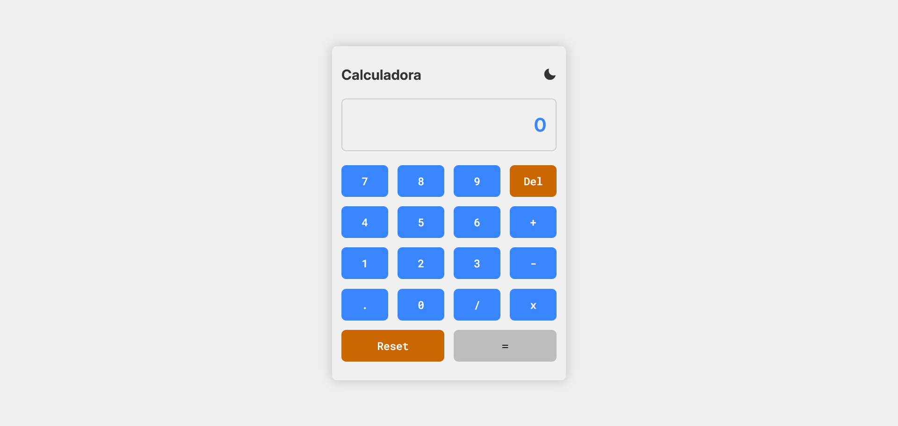
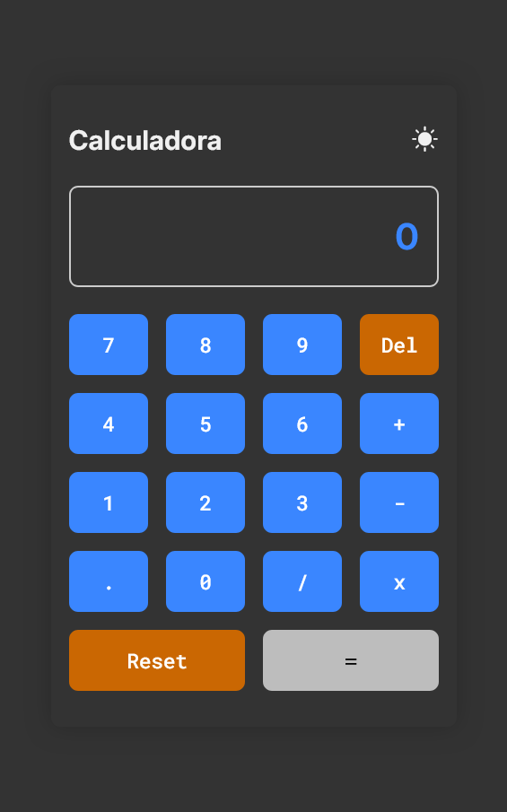

# 🧮 Simple Calculator

A basic calculator made with pure HTML, CSS, and JavaScript. Built as an exercise in DOM manipulation, events, state handling, and responsive design best practices for front-end projects.

---

## ✨ Features

- ✅ Numbers buttons from 0 to 9
- ✅ Operations: addition (+), subtraction (-), multiplication (×), division (÷)  
- ✅ Decimal point button (.)  
- ✅ Reset button to clear evrything
- ✅ Delete button to remove the last digit 
- ✅ Real-time calculatio display 
- ✅ Responsive and accessible design 
- ✅ Visual feedback on click
- ✅ Light and dark mode support

---

## 📸 Prévia | Preview

> Veja a calculadora funcionando clicando no link abaixo:

🔗 [Live site](https://tatyane-goncalves.github.io/simple-calculator/)




---

## 🛠️ Technologies

- HTML5
- CSS3
- JavaScript Vanilla 
---

## 📂 Project Structure

```bash
  📁 simple-calculator
  ├── 📁 src
  │ ├── 📁 styles
  │ │   └── style.css
  │ ├── 📁 scripts
  │ │   └── main.js
  │ └── 📁 screenshots
  │     ├── preview-desktop.png
  │     └── preview-mobile.png
  ├── index.html
  ├── README.md
  └── README-pt.md
```

---


## 🧪 How to Use
1 - Clone the repository:
```bash
git clone https://github.com/Tatyane-Goncalves/simple-calculator.git
```

2 - Navigate into the project folder:
```bash
cd simple-calculator
```

3 - Open the `index.html` file in your browser
> That's it! No back-end, no dependencies!

---

## 🎯 Objective

This project aims to practice basic `JavaScript` skills such as:
- Event handling
- Real-time state updates
- DOM manipulation
- Good UX/UI practices for simple apps

---

## 👩‍💻 Author
Made with 💜 by Tatyane Gonçalves