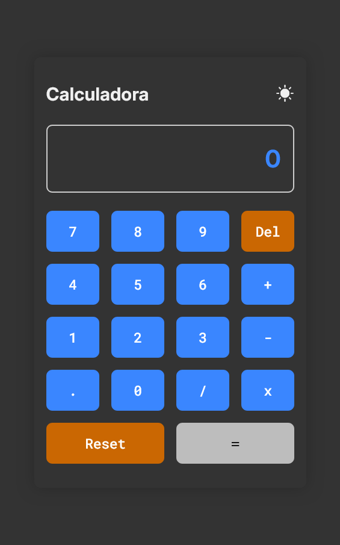

# 🧮 Calculadora Simples

Uma calculadora básica feita com HTML, CSS e JavaScript puros. Desenvolvida como exercício de manipulação do DOM, eventos, estados e boas práticas de layout responsivo para projetos front-end.

---

## ✨ Funcionalidades

- ✅ Botões de números de 0 a 9  
- ✅ Operações: adição (+), subtração (-), multiplicação (×), divisão (÷)  
- ✅ Botão de ponto decimal (.)  
- ✅ Botão de reset para limpar tudo  
- ✅ Botão de apagar último dígito  
- ✅ Cálculo exibido em tempo real  
- ✅ Design responsivo e acessível  
- ✅ Feedback visual ao clicar
- ✅ Modo claro e escuro

---

## 📸 Prévia

> Veja a calculadora funcionando clicando no link abaixo:

🔗 [Projeto em produção](https://tatyane-goncalves.github.io/simple-calculator/)




---

## 🛠️ Tecnologias 

- HTML5
- CSS3
- JavaScript Vanilla (puro)

---

## 📂 Estrutura do Projeto

```bash
  📁 simple-calculator
  ├── 📁 src
  │ ├── 📁 styles
  │ │   └── style.css
  │ ├── 📁 scripts
  │ │   └── main.js
  │ └── 📁 screenshots
  │     ├── preview-desktop.png
  │     └── preview-mobile.png
  ├── index.html
  ├── README.md
  └── README-pt.md
```

---


## 🧪 Como Usar
1 - Clone o repositório:

```bash
git clone https://github.com/Tatyane-Goncalves/simple-calculator.git
```
2 - Acesse a pasta do projeto:
```bash
cd simple-calculator
```

3 -  Abra o arquivo ` index.html` no seu navegador 
> Simples assim! Nada de back-end, nada dependências.

---

## 🎯 Objetivo 
Este projeto foi feito para treinar habilidades básicas em `JavaScript`, como:
- Captura de eventos
- Atualização de estados em tempo real
- Manipulação do DOM
- Boas práticas de UX/UI para aplicações simples


---

## 👩‍💻 Autor 
Feito com 💜 por Tatyane Gonçalves